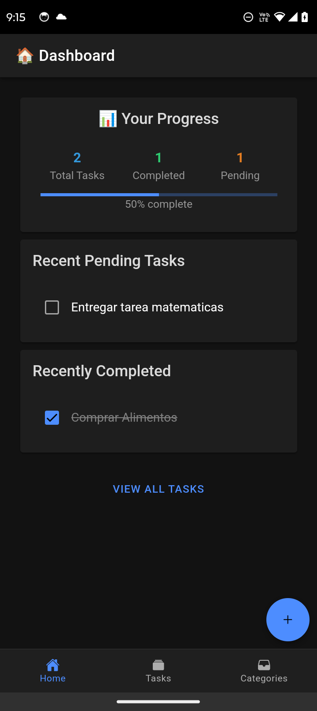
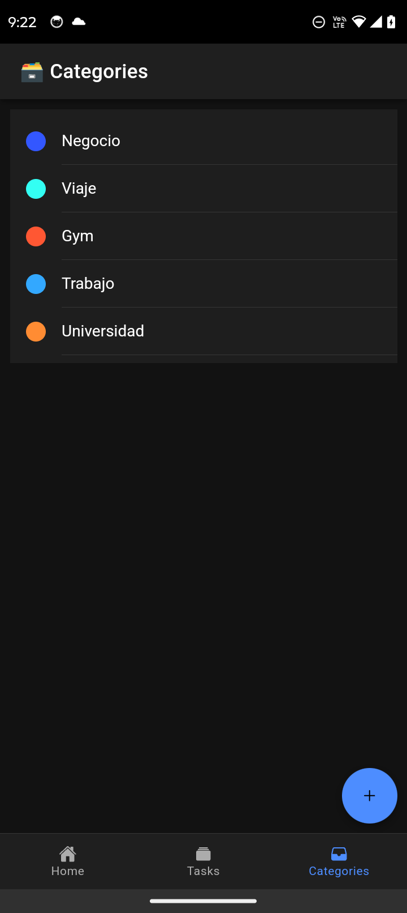

# 📚 Task App - Ionic + Angular

Task App es una aplicación para la gestión de tareas, diseñada con Ionic y Cordova, que permite a los usuarios organizar y realizar un seguimiento de sus actividades diarias.

## 🚀 Requerimientos

Antes de comenzar, asegúrate de tener instalado lo siguiente en tu sistema:

- [Node.js](https://nodejs.org/) (versión 14.x o superior)
- [Ionic CLI](https://ionicframework.com/docs/cli) (versión 6.x o superior)
- [Cordova CLI](https://cordova.apache.org/) (versión 10.x o superior)
- [Android Studio](https://developer.android.com/studio) (para compilar en Android)
- Xcode (para compilar en iOS, solo para macOS)

## 📦 Instalación

1. Clona el repositorio:

   ```bash
   git clone https://github.com/J-Ciro/task-app.git
   cd task-app
   ```

2. Instala las dependencias del proyecto:
   ```bash
   npm install
   ```

## 📱 Compilación y Ejecución

### Android

#### Opción 1: Usando la línea de comandos

1. Genera el build de producción:

   ```bash
   ionic build --prod
   ```

2. Habilita la integración con Cordova:

   ```bash
   ionic integrations enable cordova --add
   ```

3. Agrega la plataforma Android:

   ```bash
   cordova platform add android
   ```

4. Compila la aplicación:

   ```bash
   cordova build android
   ```

5. Ejecuta la aplicación en un dispositivo o emulador Android:
   ```bash
   cordova run android
   ```

#### Opción 2: Usando Android Studio

1. Abre Android Studio.
2. Selecciona la carpeta `platforms/android` generada por Ionic.
3. Compila y ejecuta la aplicación desde Android Studio.

### iOS

1. Agrega la plataforma iOS:

   ```bash
   cordova platform add ios
   ```

2. Compila la aplicación:

   ```bash
   cordova build ios
   ```

3. Abre el proyecto en Xcode desde la carpeta `platforms/ios`.
4. Compila y ejecuta la aplicación en un emulador o dispositivo iOS.

## ✨ Funcionalidades

- Crear, editar y eliminar categorías.
- Asignar una categoría a cada tarea.
- Filtrar las tareas por categoría.
- Crear, editar y eliminar tareas.
- Integracion con Firebase para la configuración remota.

## Cambios realizados

- Refactorización de componentes: Se mejoraron los tiempos de carga.
- Corrección en el uso de variables de entorno y Firebase: Configuración del entorno para el uso correcto de Firebase.
- Servicio Firebase para configuración remota: Implementación de un servicio para manejar la configuración remota desde Firebase.
- Limpieza de código: Eliminación de código comentado y dependencias no utilizadas.
- Refactorizacion de filtrado por categoría: Se mejoró el filtrado por categoría.
- Implementacion de infinite scroll: Se agregó la funcionalidad de infinite scroll para cargar más tareas y evitar cargas innecesarias.
- Se realizo compotenizacion de la aplicación: Se hizo componetizacion de la aplicación para mejorar la mantenibilidad y la reutilización de código.

## 📸 Capturas de Pantalla

Agrega aquí capturas de pantalla o grabaciones de video que muestren las funcionalidades de la aplicación. Ejemplo:

- **Pantalla de Inicio**

  

- **Gestión de Tareas**

  

- **Gestión de Categorías**

  
